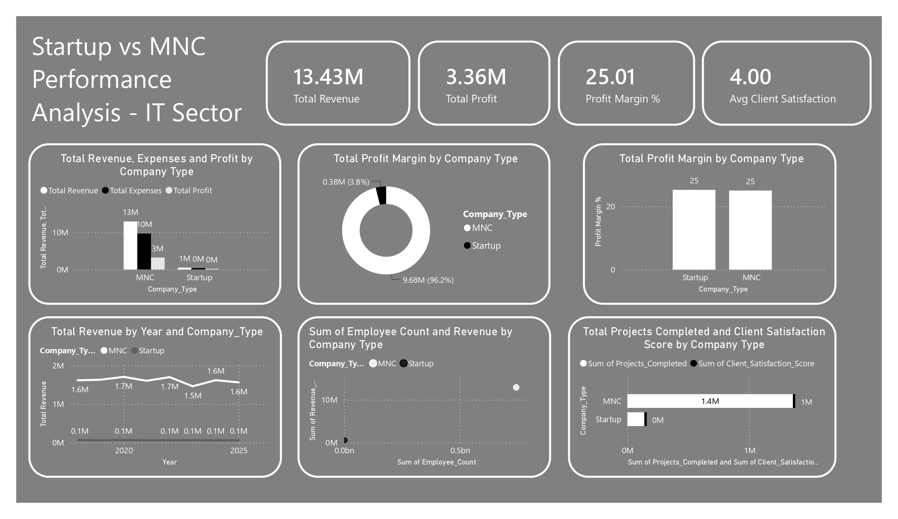

# 📊 Startup vs MNC Performance Analysis – IT Sector

A comprehensive **Power BI Dashboard** that compares the business performance of **Startups** and **Multinational Companies (MNCs)** in the IT sector. The dashboard analyzes revenue, profit, profit margins, employee strength, project completion, and client satisfaction to provide valuable business insights for decision-makers.

---

## 📷 Dashboard Preview

---

# 📌 Project Overview

The **Startup vs MNC Performance Analysis – IT Sector** dashboard provides a comparative analysis of startups and multinational companies across key financial and operational metrics.

It helps business leaders, analysts, investors, and students understand how different company types perform in terms of profitability, revenue generation, operational efficiency, and customer satisfaction.

The dashboard enables users to:

- Compare Startup and MNC financial performance
- Analyze revenue and profit trends
- Evaluate profit margins
- Measure employee contribution to revenue
- Compare project completion metrics
- Assess client satisfaction across company types

---

# 🎯 Business Problem

Organizations and investors often compare startups and established enterprises to understand their financial health and operational efficiency.

This dashboard answers important business questions such as:

- Which company type generates higher revenue?
- Which has better profitability?
- How do profit margins compare?
- Does employee count influence revenue?
- Which company type delivers more projects?
- Which organizations achieve higher client satisfaction?

---

# 📂 Dataset

The dataset includes information such as:

- Company Name
- Company Type (Startup / MNC)
- Revenue
- Expenses
- Profit
- Profit Margin
- Employee Count
- Projects Completed
- Client Satisfaction Score
- Financial Year

---

# 📈 Dashboard KPIs

| KPI | Value |
|------|--------|
| Total Revenue | **13.43M** |
| Total Profit | **3.36M** |
| Profit Margin | **25.01%** |
| Average Client Satisfaction | **4.00 / 5** |

---

# 📊 Dashboard Features

## 1. Revenue, Expenses & Profit Comparison

Compares:

- Total Revenue
- Total Expenses
- Total Profit

between:

- Startups
- MNCs

**Purpose**

- Analyze financial performance across company types.
- Identify differences in revenue generation and profitability.

---

## 2. Profit Margin Distribution

Donut chart showing the contribution of Startups and MNCs to overall profit margin.

**Purpose**

- Understand profitability distribution across company types.

---

## 3. Profit Margin Comparison

Column chart comparing average profit margins between:

- Startup
- MNC

**Purpose**

- Benchmark business profitability.

---

## 4. Revenue Trend by Year

Line chart displaying yearly revenue trends for:

- Startups
- MNCs

**Purpose**

- Track revenue growth over time.
- Compare long-term financial performance.

---

## 5. Employee Count vs Revenue

Scatter chart analyzing the relationship between:

- Employee Count
- Revenue

**Purpose**

- Evaluate workforce productivity and business scale.

---

## 6. Projects Completed & Client Satisfaction

Compares:

- Total Projects Completed
- Client Satisfaction Score

for each company type.

**Purpose**

- Measure operational performance alongside customer satisfaction.

---

# 🛠 Tools Used

- Microsoft Power BI
- Power Query
- DAX
- Microsoft Excel
- Data Modeling

---

# 📌 Key Insights

- The analyzed organizations generated a combined **13.43M** in revenue.
- Total profit reached **3.36M**, resulting in an average **25.01% profit margin**.
- MNCs contributed a larger share of total revenue and profit due to their scale.
- Startups maintained competitive profit margins despite operating with fewer resources.
- Revenue generally increased over the analyzed years for both company types.
- Higher employee counts were associated with higher revenue generation.
- Both Startups and MNCs maintained an average client satisfaction score of **4.0**, indicating strong service quality.

---

# 💼 Business Value

This dashboard helps organizations:

- Benchmark startup and enterprise performance.
- Compare financial efficiency.
- Monitor revenue and profit trends.
- Evaluate workforce productivity.
- Measure operational effectiveness.
- Support investment and strategic planning decisions.

---

# 🚀 Future Enhancements

- Company-wise drill-through analysis
- ROI and investment performance metrics
- Regional and global company comparison
- Industry-wise benchmarking
- Predictive revenue forecasting using Machine Learning
- Interactive executive scorecards

---

# 📚 Skills Demonstrated

- Data Cleaning
- Data Modeling
- Power Query
- DAX Measures
- KPI Development
- Financial Analytics
- Business Intelligence
- Dashboard Design
- Executive Reporting
- Data Visualization

---

# 👨‍💻 Author

**Yashwanth Katuru**

Aspiring Data Analyst | Power BI Developer

### Technical Skills

- Power BI
- SQL
- Excel
- Python
- Data Analytics
- Financial Analytics
- Dashboard Development
